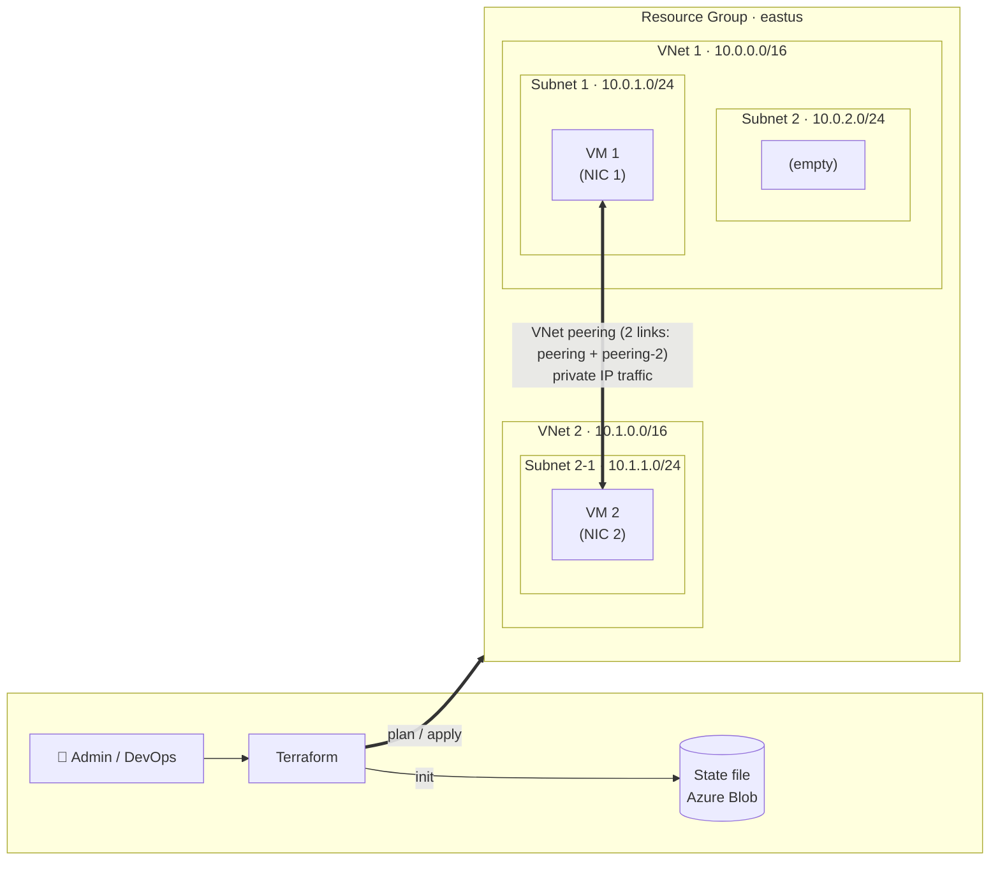

# Azure VNet Peering (Terraform)

Two VNets in the same resource group, connected by VNet peering so that VMs in each VNet can reach each other over private IPs.

```mermaid
%%{init: {"flowchart": {"wrappingWidth": 320}}}%%
flowchart LR
    subgraph OPS[" "]
        direction TB
        admin["👤 Admin / DevOps"] --> tf["Terraform"]
        tf -->|init| state[("State file<br/>Azure Blob")]
    end

    subgraph RG["Resource Group · eastus"]
        subgraph VNET1["VNet 1 · 10.0.0.0/16"]
            subgraph S1["Subnet 1 · 10.0.1.0/24"]
                vm1["VM 1<br/>(NIC 1)"]
            end
            subgraph S2["Subnet 2 · 10.0.2.0/24"]
                empty1["(empty)"]
            end
        end

        subgraph VNET2["VNet 2 · 10.1.0.0/16"]
            subgraph S21["Subnet 2-1 · 10.1.1.0/24"]
                vm2["VM 2<br/>(NIC 2)"]
            end
        end
    end

    tf ==>|plan / apply| RG
    vm1 <==>|"VNet peering (2 links: peering + peering-2)<br/>private IP traffic"| vm2
```
